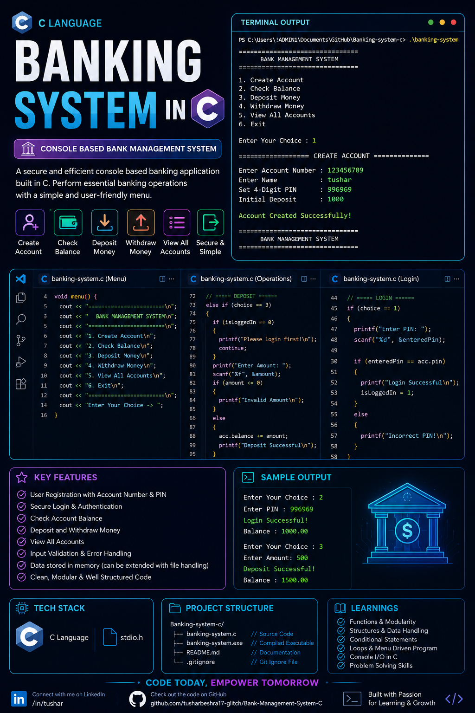

# 🏦 Bank Management System in C

A simple console-based Bank Management System built using C. The project allows users to create an account, log in using a PIN, check balance, deposit money, and withdraw money through a menu-driven interface.

## 🚀 Features

* Account Creation
* PIN-Based Login System
* Check Balance
* Deposit Money
* Withdraw Money
* Menu-Driven Interface
* Function-Based Program Structure
* Input Validation for Banking Operations

## 🛠️ Technologies Used

* C Programming Language
* Standard Input/Output Library (`stdio.h`)

## 📚 Concepts Used

* Structures (`struct`)
* Global Variables
* Functions
* Loops
* Conditional Statements
* User Authentication

## 🎯 Future Improvements

* File Handling
* Transaction History
* Change PIN
* Multiple Accounts
* Money Transfer Feature
* Menu-Driven Programming

## 👨‍💻 Author

Tushar Beshra
